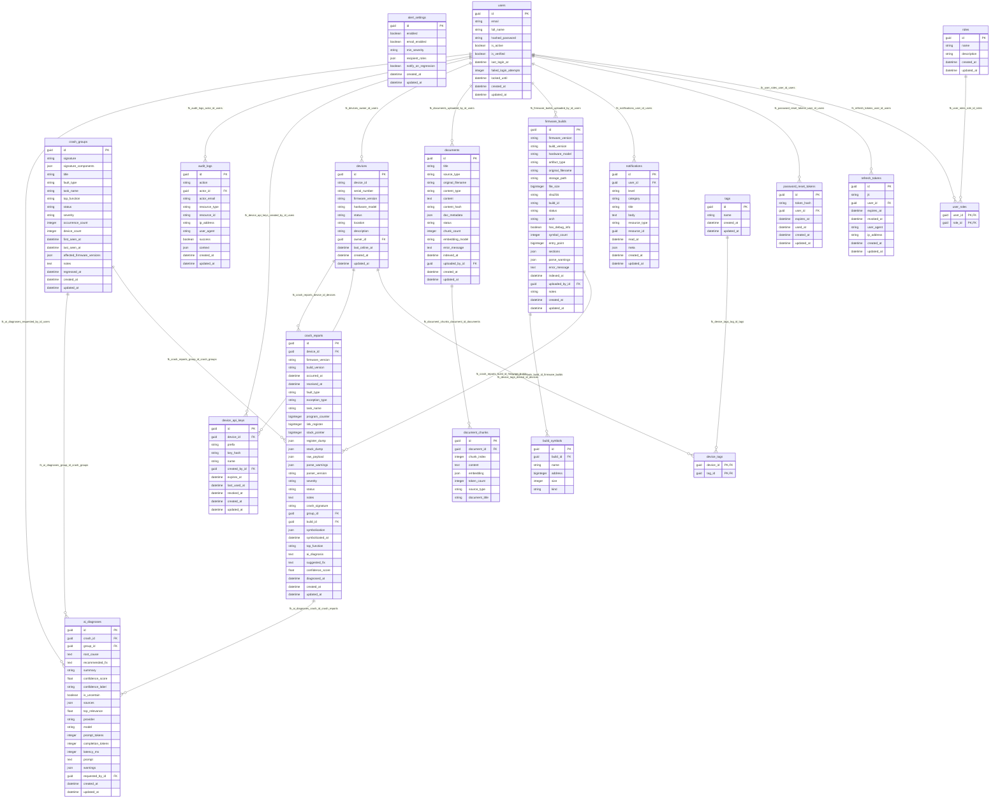

# Entity-Relationship Diagram

> Generated from the SQLAlchemy models by `backend/scripts/generate_er_diagram.py`. Do not edit by hand — re-run the script after a schema change.

Tables: **19**

```mermaid
erDiagram
    ai_diagnoses {
        guid id PK
        guid crash_id FK
        guid group_id FK
        text root_cause
        text recommended_fix
        string summary
        float confidence_score
        string confidence_label
        boolean is_uncertain
        json sources
        float top_relevance
        string provider
        string model
        integer prompt_tokens
        integer completion_tokens
        integer latency_ms
        text prompt
        json warnings
        guid requested_by_id FK
        datetime created_at
        datetime updated_at
    }
    alert_settings {
        guid id PK
        boolean enabled
        boolean email_enabled
        string min_severity
        json recipient_roles
        boolean notify_on_regression
        datetime created_at
        datetime updated_at
    }
    audit_logs {
        guid id PK
        string action
        guid actor_id FK
        string actor_email
        string resource_type
        string resource_id
        string ip_address
        string user_agent
        boolean success
        json context
        datetime created_at
        datetime updated_at
    }
    build_symbols {
        guid id PK
        guid build_id FK
        string name
        biginteger address
        integer size
        string kind
    }
    crash_groups {
        guid id PK
        string signature
        json signature_components
        string title
        string fault_type
        string task_name
        string top_function
        string status
        string severity
        integer occurrence_count
        integer device_count
        datetime first_seen_at
        datetime last_seen_at
        json affected_firmware_versions
        text notes
        datetime regressed_at
        datetime created_at
        datetime updated_at
    }
    crash_reports {
        guid id PK
        guid device_id FK
        string firmware_version
        string build_version
        datetime occurred_at
        datetime received_at
        string fault_type
        string exception_type
        string task_name
        biginteger program_counter
        biginteger link_register
        biginteger stack_pointer
        json register_dump
        json stack_dump
        json raw_payload
        json parse_warnings
        string parser_version
        string severity
        string status
        text notes
        string crash_signature
        guid group_id FK
        guid build_id FK
        json symbolication
        datetime symbolicated_at
        string top_function
        text ai_diagnosis
        text suggested_fix
        float confidence_score
        datetime diagnosed_at
        datetime created_at
        datetime updated_at
    }
    device_api_keys {
        guid id PK
        guid device_id FK
        string prefix
        string key_hash
        string name
        guid created_by_id FK
        datetime expires_at
        datetime last_used_at
        datetime revoked_at
        datetime created_at
        datetime updated_at
    }
    device_tags {
        guid device_id PK,FK
        guid tag_id PK,FK
    }
    devices {
        guid id PK
        string device_id
        string serial_number
        string firmware_version
        string hardware_model
        string status
        string location
        string description
        guid owner_id FK
        datetime last_online_at
        datetime created_at
        datetime updated_at
    }
    document_chunks {
        guid id PK
        guid document_id FK
        integer chunk_index
        text content
        json embedding
        integer token_count
        string source_type
        string document_title
    }
    documents {
        guid id PK
        string title
        string source_type
        string original_filename
        string content_type
        text content
        string content_hash
        json doc_metadata
        string status
        integer chunk_count
        string embedding_model
        text error_message
        datetime indexed_at
        guid uploaded_by_id FK
        datetime created_at
        datetime updated_at
    }
    firmware_builds {
        guid id PK
        string firmware_version
        string build_version
        string hardware_model
        string artifact_type
        string original_filename
        string storage_path
        biginteger file_size
        string sha256
        string build_id
        string status
        string arch
        boolean has_debug_info
        integer symbol_count
        biginteger entry_point
        json sections
        json parse_warnings
        text error_message
        datetime indexed_at
        guid uploaded_by_id FK
        string notes
        datetime created_at
        datetime updated_at
    }
    notifications {
        guid id PK
        guid user_id FK
        string level
        string category
        string title
        text body
        string resource_type
        guid resource_id
        datetime read_at
        json meta
        datetime created_at
        datetime updated_at
    }
    password_reset_tokens {
        guid id PK
        string token_hash
        guid user_id FK
        datetime expires_at
        datetime used_at
        datetime created_at
        datetime updated_at
    }
    refresh_tokens {
        guid id PK
        string jti
        guid user_id FK
        datetime expires_at
        datetime revoked_at
        string user_agent
        string ip_address
        datetime created_at
        datetime updated_at
    }
    roles {
        guid id PK
        string name
        string description
        datetime created_at
        datetime updated_at
    }
    tags {
        guid id PK
        string name
        datetime created_at
        datetime updated_at
    }
    user_roles {
        guid user_id PK,FK
        guid role_id PK,FK
    }
    users {
        guid id PK
        string email
        string full_name
        string hashed_password
        boolean is_active
        boolean is_verified
        datetime last_login_at
        integer failed_login_attempts
        datetime locked_until
        datetime created_at
        datetime updated_at
    }
    crash_groups ||--o{ ai_diagnoses : "fk_ai_diagnoses_group_id_crash_groups"
    crash_reports ||--o{ ai_diagnoses : "fk_ai_diagnoses_crash_id_crash_reports"
    users ||--o{ ai_diagnoses : "fk_ai_diagnoses_requested_by_id_users"
    users ||--o{ audit_logs : "fk_audit_logs_actor_id_users"
    firmware_builds ||--o{ build_symbols : "fk_build_symbols_build_id_firmware_builds"
    firmware_builds ||--o{ crash_reports : "fk_crash_reports_build_id_firmware_builds"
    crash_groups ||--o{ crash_reports : "fk_crash_reports_group_id_crash_groups"
    devices ||--o{ crash_reports : "fk_crash_reports_device_id_devices"
    devices ||--o{ device_api_keys : "fk_device_api_keys_device_id_devices"
    users ||--o{ device_api_keys : "fk_device_api_keys_created_by_id_users"
    tags ||--o{ device_tags : "fk_device_tags_tag_id_tags"
    devices ||--o{ device_tags : "fk_device_tags_device_id_devices"
    users ||--o{ devices : "fk_devices_owner_id_users"
    documents ||--o{ document_chunks : "fk_document_chunks_document_id_documents"
    users ||--o{ documents : "fk_documents_uploaded_by_id_users"
    users ||--o{ firmware_builds : "fk_firmware_builds_uploaded_by_id_users"
    users ||--o{ notifications : "fk_notifications_user_id_users"
    users ||--o{ password_reset_tokens : "fk_password_reset_tokens_user_id_users"
    users ||--o{ refresh_tokens : "fk_refresh_tokens_user_id_users"
    roles ||--o{ user_roles : "fk_user_roles_role_id_roles"
    users ||--o{ user_roles : "fk_user_roles_user_id_users"
```
